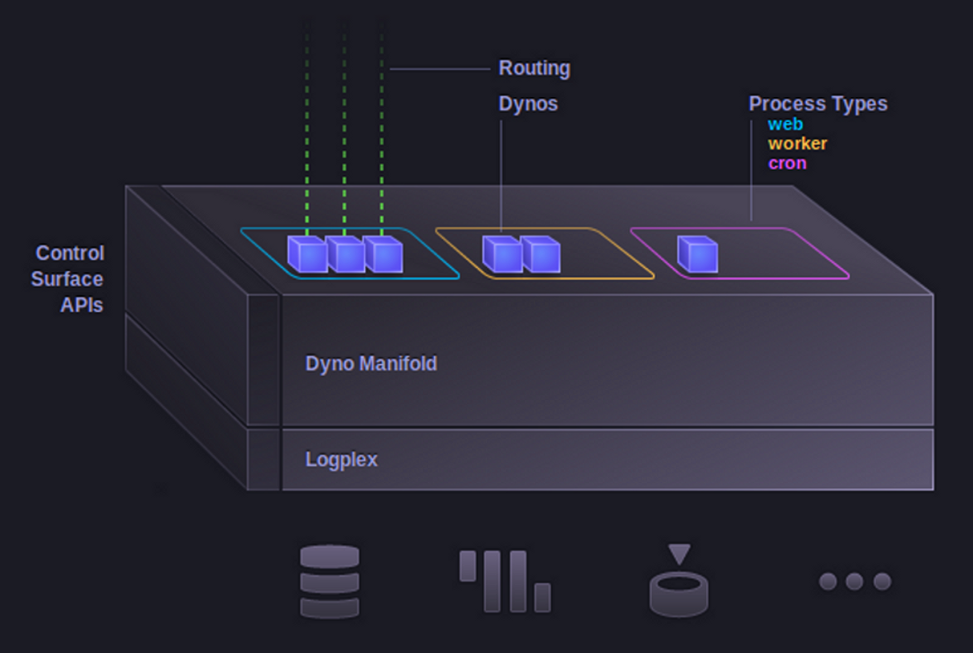
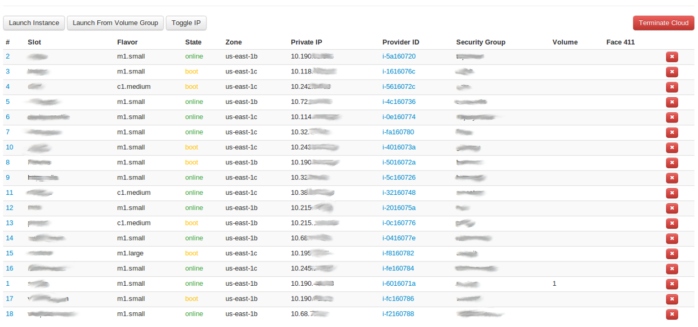

!SLIDE
# How Heroku Builds #
# Heroku on Heroku #

### Tristan Sloughter ###
### Erlang Routing Infastructure Engineer ###
### (tristan@heroku.com @t_sloughter) ###

!SLIDE 

!SLIDE bullets 
# This Talk #

* What is a PaaS?
* How work at Heroku gets done
* How we eat our own dogfood

!SLIDE 

!SLIDE bullets 
# Software as a Service (SaaS) #

* Google Apps
* Salesforce

!SLIDE bullets 
# Infastructure as a Service (IaaS) #

* AWS
* Joyent

!SLIDE bullets 
# Platform as a Service (PaaS) #

* Heroku!

!SLIDE code

# Example: These Slides #

    @@@ Bash
    λ showoff create barcamp_2012
    ....
    λ cat .git/config
    ....
    [remote "heroku"]
	url = git@heroku.com:chibarcamp2012.git
	fetch = +refs/heads/*:refs/remotes/heroku/*
   

!SLIDE code
# git push heroku master #

    @@@ Bash
    λ git push heroku master
    Counting objects: 9, done.
    Delta compression using up to 8 threads.
    Compressing objects: 100% (6/6), done.
    Writing objects: 100% (6/6), 425.01 KiB | 217 KiB/s, done.
    Total 6 (delta 1), reused 0 (delta 0)
    -----> Heroku receiving push
    -----> Ruby/Rack app detected
    -----> Installing dependencies using Bundler 
    -----> Discovering process types
           Procfile declares types     -> (none)
           Default types for Ruby/Rack -> console, rake
    -----> Compiled slug size: 5.1MB
    -----> Launching... done, v6
           http://chibarcamp2012.herokuapp.com deployed 
    To git@heroku.com:chibarcamp2012.git
        26c868e..68bb90c  master -> master

!SLIDE code
# Inspect #

    @@@ Bash
    λ heroku ps
    === web: `bundle exec rackup config.ru -p $PORT`
    web.1: up 2012/09/21 17:01:00 (~ 13m ago)

    λ heroku logs
    2012-09-21T21:26:54+00:00 heroku[router]: GET
    chibarcamp2012.herokuapp.com/css/showoff.css dyno=web.1
    queue=0 wait=0ms service=6ms status=200 bytes=9950

    2012-09-21T21:26:54+00:00 app[web.1]: 2.227.122.12
    [21/Sep/2012 21:26:54] "GET /js/jquery-1.4.2.min.js
    HTTP/1.1" 200 72173 0.0007

!SLIDE bullets
# What Just Happened? #

* Did we provision a server?
* Did we manually install any software?
* Did we manually build artifacts and deploy?

!SLIDE bullets
# Building for the Cloud#

*
*

!SLIDE bullets
# A bit about how we work #

* Campfire
* Personal heroku clouds
* Github/Trello/Pivotal/Nagios/Graphite/PagerDuty/Splunk/....
* Deploy often, watch the graphs and logs!

!SLIDE 
# Personal Herokus #

    @@@ Bash
    λ bin/ion devcloud setup

!SLIDE

!SLIDE bullets
# How Heroku Uses Heroku #

* Why dogfood?
*

!SLIDE

# Routing #

* Erlang system
* Takes Cedar stack requests from ELBs and routes to dynos
* Is deployed as an Heroku app

!SLIDE code

    @@@ Bash
    λ cat Procfile 
    web: bin/routing

!SLIDE code
# Ship #

    @@@ Bash
    $ bin/ship -b v6 -c deploymaster -u degan

!SLIDE code
# In Campfire #

    @@@ Bash
    >cut release ion-<me> routing master

!SLIDE
# Conclusion #

*
*
*
